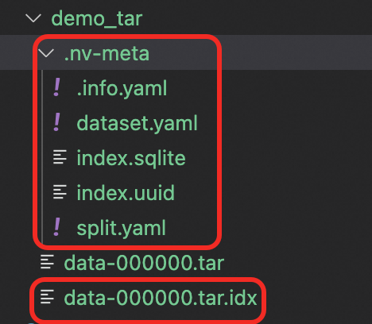
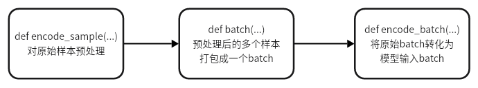

# Megatron-Energon 大规模数据加载库

搭配Megatron训练框架食用   [Energon完整官方教程](https://nvidia.github.io/Megatron-Energon/index.html)

## 数据构建全流程

[官方教程](https://nvidia.github.io/Megatron-Energon/basic/data_prep.html)

1. 准备数据    

   下载本仓库data/demo_data.zip并解压

   ```bash
   /demo_data/
   ├── 000001.png
   ├── 000001.txt
   ├── 000002.png
   ├── 000002.txt
   ...
   ```

2. 打包成webdataset格式的tar文件

   ```python
   import os
   from PIL import Image
   import io
   import webdataset as wds
   demo_data="/xx/demo_data" # demo数据文件夹路径
   save_folder="/xxx/" # tar包保存路径
   
   def load_my_dataset(data_dir):
       for fname in os.listdir(data_dir):
           if fname.endswith(".png"):
               key = fname[:-4]  # 去掉 .png 后缀
               with open(os.path.join(data_dir, fname), "rb") as f_img:
                   image_bytes = f_img.read()
               with open(os.path.join(data_dir, key + ".txt"), "r", encoding="utf-8") as f_txt:
                   caption = f_txt.read().strip()
               yield key, {"image": image_bytes, "caption": caption.encode("utf-8")} # 迭代器，避免内存溢出
   
   # 构建dataset
   my_dataset = load_my_dataset(data_dir = demo_data)
   
   # 构建webdataset格式的tar包
   with wds.ShardWriter(os.path.join(save_folder,"data-%06d.tar"), maxcount=1000) as sink:
       for key, data in my_dataset:
           sink.write({
               "__key__": key, # 唯一标识符，例如uuid
               "png": data["image"],
               "txt": data["caption"],
           })
   ```

3. 构建成energon格式

   （1）整理好数据，格式如下

   ```
   /xxx/
   ├── data-000000.tar
   └── data-000001.tar
   └── ...	
   ```

   （2）进入到终端交互界面，开始构建

   ```bash
   > energon prepare /xx/demo_data/ #tar所属的文件夹路径  
   Ratio: 10,0,0  # 指定train、val、text比例  输入10,0,0回车
   Dataset class: 0  # 指定数据解析策略  输入0回车，代表CaptioningSample
   Please enter a webdataset field name for 'image' (<class 'torch.Tensor'>): png #指明数据集的图片格式
   Please enter a webdataset field name for 'caption' (<class 'str'>): txt # 指明caption的文件格式
   ```

​	（3）将生成一些额外文件  详细解释查看[link](https://nvidia.github.io/Megatron-Energon/basic/data_prep.html#dataset-yaml)



|                       | 优势                                                         |
| --------------------- | ------------------------------------------------------------ |
| tar.idx               | 是tar 的**快速索引表**，记录了每个文件在 tar包中的偏移地址、大小等元数据。**快速定位和读取指定的文件**，而无需解压整个 .tar 文件 |
| .nv-meta/index.sqlite | 记录tar包更多元数据，更灵活、结构化，适合更复杂的访问模式。  |
| .nv-meta/.info.yaml   | 每个tar包含多少文件                                          |
| .nv-meta/dataset.yaml | 记录了数据采样策略、数据集图像、文本的映射规则               |
| .nv-meta/split.yaml   | 记录了数据集如何划分                                         |

4. 读取数据

   ```python
   from megatron.energon import get_train_dataset, get_loader, WorkerConfig
   
   ds = get_train_dataset(
       'xxx/demo_tar',
       batch_size=2,
       shuffle_buffer_size=100,
       max_samples_per_sequence=100,
       worker_config=WorkerConfig.default_worker_config(),
   )
   
   loader = get_loader(ds)
   
   for batch in loader:
       print(batch) # 经过采样->预处理后的数据
   ```

   

   

## 自定义数据解析策略

[官方文档](https://nvidia.github.io/Megatron-Energon/basic/data_prep.html)

（1）官方提供N个数据解析策略,如CaptioningSample、InterleavedSample等

（2）自定义

  方法一   ` .nv-meta` 文件夹中创建 `sample_loader.py ` 自定义数据解析

  方法二   采用CrudeWebdataset类，将原始格式的样本传入TaskEncoder，然后重写`def encode_sample`方法自定义解析过程。 详见[link](https://nvidia.github.io/Megatron-Energon/advanced/advanced_dataformat.html#crude-data)


## 自定义Task Encoder 

[官方文档](https://nvidia.github.io/Megatron-Energon/basic/task_encoder.html)

在整个数据流，灵活自定义每个函数。完整示例代码在本仓库`code/my_task_encoder.py`   

更详细的数据流和函数调用图访问[link](https://nvidia.github.io/Megatron-Energon/basic/basics_flow.html)



常用的几个方法

1. encode_sample    如何解析原始数据。  如果当前样本残缺，可通过raise `IgnoreSample` 跳过当前样本。
2. select_samples_to_pack  （可选）自定义哪种packing策略  比如greedy、lphfp
3. pack_selected_samples   自定义packing过程


## 数据配比用法

[官方文档](https://nvidia.github.io/Megatron-Energon/basic/metadataset.html)

1. 通过编写yaml文件  调整不同数据集的配比
2. 通过Subflavors属性区分不同数据集来源，以便更精细的操作

## 保存和恢复Dataloader状态

数据并行下，每个Rank都有自己的dataloader状态 ，独立保存并恢复。 [官方文档](https://nvidia.github.io/Megatron-Energon/basic/save_restore.html)

### 保存状态

```python
from megatron.energon import get_train_dataset, get_savable_loader, WorkerConfig
import torch
# 1. 初始化dataset
worker_config = WorkerConfig.default_worker_config() #获取当前Rank状态
ds = get_train_dataset(
    'xxx/megatron_data', # 下载本仓库data/megatron_data.tar并解压的文件夹路径
    batch_size=2,
    shuffle_buffer_size=100,
    max_samples_per_sequence=100,
    worker_config=worker_config,
)
# 2. 初始化dataloader
loader = get_savable_loader(ds)

for i, batch in zip(range(10), loader):
    print(batch)
    break

# 3. 保存数据集状态
state = loader.save_state_rank() # 获取状态
torch.save(state, f'/xxx/dataloader_state_rank{worker_config.rank}.pth')
```

### 恢复状态

```python
from megatron.energon import get_train_dataset, get_savable_loader, WorkerConfig
import torch
# 1. 原样初始化dataset
worker_config = WorkerConfig.default_worker_config()
ds = get_train_dataset(
    'xxx/megatron_data', # 下载本仓库data/megatron_data.tar并解压的文件夹路径
    batch_size=2,
    shuffle_buffer_size=100,
    max_samples_per_sequence=100,
    worker_config=WorkerConfig.default_worker_config(),
)
# 2. 原样初始化dataloader
loader = get_savable_loader(ds) 

# 3. 加载状态并恢复
state = torch.load(f'/xxx/dataloader_state_rank{worker_config.rank}.pth')
loader.restore_state_rank(state)
```


