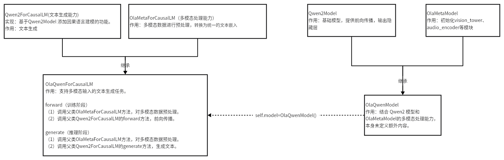

# Transformers基础


## Transformers库

### Tokenizer用法


```python
from transformers import AutoTokenizer
tokenizer = AutoTokenizer.from_pretrained("/xxx/xxx") # 加载tokenizer

# 对文本进行编码,生成token_id
text = "这是一个示例文本。"
encoded_text = tokenizer.encode(text)

# 将编码后的序列id解码为原始文本
decoded_text = tokenizer.decode(encoded_text)

print("原始文本：", text)
print("解码后的文本：", decoded_text)
```

## 名词解释

### 全局标记BOS  EOS 

- BOS 是 “Beginning of Sentence” 的缩写，告诉模型何时开始生成，表示句子的开始。
- EOS 是 “End of Sentence” 的缩写，告诉模型何时停止生成，表示句子的结束。

### 局部标记<|im_start|>   <|im_end|>

- <|im_start|>  表示消息开始，缩写“input message start”。
- <|im_end|>   表示消息结束，缩写“input message end”。

### 两者区别

|                                | 用途                                       |
| ------------------------------ | ------------------------------------------ |
| BOS  EOS                       | 用于**序列生成**，标记整个文本的开始和结束 |
| <\|im_start\|>    <\|im_end\|> | 用于**对话生成**，区分对话中的不同角色     |

```
<|im_start|>user
Hi, how are you? <|im_end|>
<|im_start|>assistant
I'm good, thank you! How can I help you today? <|im_end|>
<|im_start|>user
Can you help me with a math problem? <|im_end|>
```

```
<BOS> <|im_start|>user
Hi, how are you? <|im_end|> <|im_start|>assistant
I'm good, thank you! How can I help you today? <|im_end|> <|im_start|>user
Can you help me with a math problem? <|im_end|> <EOS>
```

### Special Token

| **Special Token** | **含义**             | **用途**                                                     |
| ----------------- | -------------------- | ------------------------------------------------------------ |
| `[UNK]`           | Unknown Token        | 未知标记，用于表示输入序列中不在词汇表中的单词。             |
| `[CLS]`           | Classification Token | 输入序列的开始。                                             |
| `[SEP]`           | Separator Token      | 输入序列的结束。                                             |
| `[PAD]`           | Padding Token        | 用于填充短序列，使得所有序列长度一致。                       |
| `[MASK]`          | Mask Token           | 在掩码语言建模任务中，用于掩盖部分词汇，模型需要预测这些词。 |

### Base/Instruction/Chat区别

| 类型            | 经历阶段                     | 特点                                                         |
| --------------- | ---------------------------- | ------------------------------------------------------------ |
| Base模型        | Pretrain                     | 经过大规模数据的无监督学习，掌握基本的语言生成能力和背景知识，具备语言理解能力。 |
| Instruction模型 | Pretrain + SFT + RLHF        | 经过监督微调和强化学习，理解和执行复杂的自然语言指令。       |
| Chat模型        | Pretrain + SFT + RLHF + 微调 | 经过进一步微调，专注于对话的上下文理解能力和多轮交流连贯性。 |

### LLM输入参数

| **参数**               | **含义**                 | **作用**                                                    |
| ---------------------- | ------------------------ | ----------------------------------------------------------- |
| input_ids              | 输入文本的 token ID 序列 | 表示文本的实际内容，用数字标识每个词汇或子词。              |
| attention_mask         | 注意力掩码               | 表示哪些token有效，哪些是填充token。1有效、0填充            |
| position_ids (可选)    | 位置编码                 | 每个 token 在输入序列中的位置，大部分模型会自动生成位置编码 |
| labels (可选)          | 训练标签                 | 训练时的真值标签，推理时为None                              |
| past_key_values (可选) | 缓存之前的计算结果       | 在生成长文本时避免重复计算，提高生成效率                    |
| use_cache (可选)       | 是否使用缓存             | 是否使用past_key_values。用于推理时提高生成效率。           |
| return_tensors (可选)  | 是否返回张量格式的数据   | 取值为 "pt"（PyTorch）或 "tf"（TensorFlow）                 |

```json
{
    'input_ids': tensor([
        [  101,  1045,  1005,  2310,  2042,  3403,  2005,  1037, 17662, 12172, 2607,  2026,  2878,  2166,  1012,   102],
        [  101,  1045,  5223,  2023,  2061,  2172,   999,   102,     0,     0,     0,     0,     0,     0,     0,     0]
    ]), 
    'attention_mask': tensor([
        [1, 1, 1, 1, 1, 1, 1, 1, 1, 1, 1, 1, 1, 1, 1, 1],
        [1, 1, 1, 1, 1, 1, 1, 1, 0, 0, 0, 0, 0, 0, 0, 0]
    ])
}
```


### chat_template教程

https://huggingface.co/docs/transformers/zh/chat_templating

### QwenModel、QwenForCausalLM、QwenForConditionalGeneration三者区别

| 特性         | QwenModel                              | QwenForCausalLM                                              | QwenForConditionalGeneration                       |
| ------------ | -------------------------------------- | ------------------------------------------------------------ | -------------------------------------------------- |
| **作用**     | 基础类，仅生成隐藏层的输出。           | 用于因果语言建模（Causal Language Modeling），生成和语言建模任务的解码头部，预测后续的 token 序列。 | 基于给定输入生成文本，生成的文本依赖于输入条件。   |
| **模型包含** | 仅包含 QwenModel 部分                  | 包含 QwenModel 和解码头部                                    | 包含 QwenModel 和条件生成头部                      |
| **适用任务** | 特征提取任务，如文本嵌入、分类任务等。 | 自回归文本生成任务，逐步生成文本。                           | 条件生成任务，依赖输入条件生成文本，如翻译或摘要。 |


### LLaVA模型架构图



